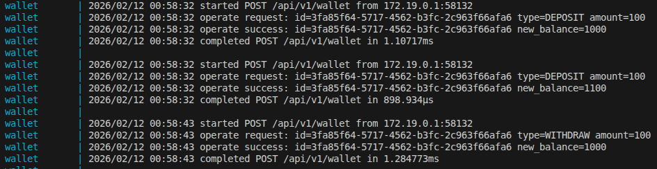

### 1. Запустить БД

```bash
docker-compose up -d postgres
```

### 2. Применить миграции
Миграции с помощью `goose`:

```bash
goose -dir migrations postgres "host=localhost port=5432 user=myuser password=mypassword dbname=test_db sslmode=disable" up
```

Для установки goose:
```bash
go install github.com/pressly/goose/v3@latest
```

### 3. Запустить приложение

```bash
docker-compose up --build
```
Приложение будет доступно на `http://localhost:8080`.

В корне проекта находится файл test.postman_collection.json - коллекция Postman, содержащая примеры запросов для эндпоинтов.

Логи формата: 
---

## Особенности POST /api/v1/wallet

**Пример запроса:**
```json
{
  "walletId": "a0eebc99-9c0b-4ef8-bb6d-6bb9bd380a11",
  "operationType": "DEPOSIT",
  "amount": 1000
}
```

- Если кошелька с таким walletId ещё нет, и операция DEPOSIT, то он автоматически создаётся с балансом = amount.
- Если операция WITHDRAW, а кошелька не существует — вернётся ошибка 404 Not Found.
- При WITHDRAW проверяется наличие достаточных средств. Если денег недостаточно 409 Conflict.

---

## Тестирование

Запустить unit-тесты:
```bash
go test -v ./...
```
